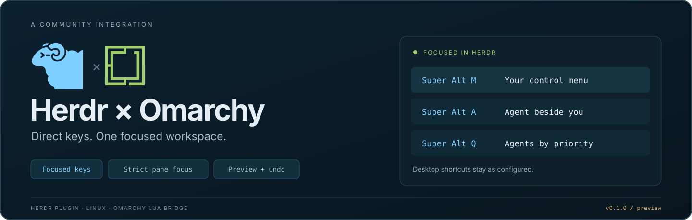

<p align="center"></p>

# Herdr × Omarchy

**One chord for your everyday Herdr actions.** Split, swap, navigate, launch agents,
and open Lazygit with **Super+Alt**, while keeping your Omarchy shortcuts.

Herdr Shell (`blr.herdr-shell`) uses your existing Herdr's plugin system and API.
An Omarchy companion manages the Herdr plugin and a Hyprland bridge that checks
conflicts before routing free chords to focused local Herdr. Your Herdr binary,
desktop bindings, and appearance settings stay in place. This is a development preview.

## Install

Requires **Linux, Herdr 0.9.3+, Python 3.11+, curses, and tomlkit**. Direct shortcuts
also require Omarchy's **Lua Hyprland config**, its `require("default.hypr.omarchy")`
loader, `hyprctl`, and `luac`. Agents use Omarchy's configured default, or its picker;
Lazygit requires `lazygit`. Editor/files popups use `$VISUAL`/`$EDITOR` (default
`nvim`) and `yazi` or `ranger`.

Run from **any terminal**:

```sh
sudo pacman -S --needed git python python-tomlkit lua
omarchy plugin add https://github.com/baileyrosen3/omarchy-herdr.git --enable
```

Omarchy clones the repository automatically. The companion sets up Herdr and
free desktop shortcuts in the background within a few seconds. If Herdr is not
running yet, open it normally; no restart is needed. Add `~/.local/bin` to `PATH`
for `herdr-shell`.

**Migrating from a developer-linked installation?** From any Herdr pane, run
`herdr-shell remove --apply` before the Omarchy add command. It keeps the old
checkout, settings, and history. The companion preserves an existing developer
installation until you remove its integration. See [Contributing](CONTRIBUTING.md)
for the checkout-based development workflow.

**Super+Alt+M** opens/closes the menu. Existing **Super+Ctrl+Enter** still opens
Herdr, and **Super+Space** keeps the Omarchy menu. Occupied chords remain reserved;
the menu reports which shortcuts are ready. Native recovery uses your Herdr prefix,
then **Space** for the menu or **Alt+K** for keybindings. With Omarchy's Ctrl+Space
prefix, press it, release, then press Space.
Outside Herdr, or with the profile off, its chords pass through to the focused app.

## All 26 direct shortcuts

Hold **Super+Alt**, then press the key below. Shift is written explicitly.

| Key | Action |
| --- | --- |
| **M** | Toggle the control menu |
| **U / D / L / R** | Split above / below / left / right |
| **Shift+U / Shift+D / Shift+L / Shift+R** | Swap with the pane above / below / left / right |
| **J** | Rotate the nearest two-pane split between stacked and side by side |
| **Z** | Zoom / restore the pane |
| **X** | Close the pane |
| **P / Shift+P** | Next / previous pane in this tab |
| **T / W** | Create / close a tab |
| **Shift+T / Shift+W** | Create / close a workspace |
| **PageUp / PageDown** | Previous / next tab |
| **Shift+PageUp / Shift+PageDown** | Previous / next workspace |
| **A** | Start your default Omarchy agent in a pane to the right |
| **Q / Shift+Q** | Next / previous agent by priority |
| **V** | Open Lazygit in a pane to the right |

Omarchy's native **Ctrl+Alt+arrows** focus neighboring panes; focus stops at an
edge. **Ctrl+Alt+Shift+arrows** resize. Tab, workspace, and pane cycles wrap.
New panes, tabs, workspaces, agents, and Lazygit inherit the originating directory.

Agent sweeps visit **approval/input → done → working → idle**, keeping their order
stable through each sweep so status changes cannot trap you on one agent.
Closing an idle shell runs directly; agents, running work, and uncertain activity
require confirmation with **Cancel selected first**. Tab/workspace close checks
all affected panes. Menu and direct close commands use the same policy.

## The control menu

Home is a grouped, **one-line shortcut sheet covering all 26 chords**. Inactive or
limited commands remain visible with a marker; **F1** explains the selected action,
its full chord, and any restriction. Other sections are All, Launch, Navigate,
Panes, Workspaces, and Configure. Search reaches every command and destination.

Type to search, **↑↓** to select, **Enter** to act, **Tab/Shift+Tab** to change
sections, and **Esc** to clear search, go back, or close. **F2** opens Keybindings,
**Ctrl+O/F3** Settings, **Ctrl+R** refreshes, and **Ctrl+Z/F4** reviews config undo.
Search and selection survive editing and refresh. The menu uses your terminal
palette and retains the Herdr/Omarchy branding; minimum size is **46 × 16**.

## Learn by doing

First use offers **Walkthrough**, **Learning game**, or **Open menu**; Esc skips
onboarding. Reopen it by searching `learn`, or use:

```sh
herdr-shell learn
herdr-shell learn walkthrough
herdr-shell learn game
```

The walkthrough is read-only. **Herdr Key Quest** has **26 live shortcut missions**.
Enter prepares a labeled practice target; press its full **Super+Alt** chord,
watch the action, and earn points when Herdr verifies the result. The guide stays
safe while splits, swaps, closes, tabs, and workspace jumps use disposable targets.
Practice agents are harmless simulations. Git practice uses a temporary repository
with Lazygit, or a labeled simulator when Lazygit is unavailable.
M opens the real menu in a browsing-only practice view, then M closes it.

The game requires active shortcuts. **F1** explains, **F3** skips or replays skipped
missions, and Esc stops unchanged simulators while keeping the practice spaces.
Zoom practices both presses; each agent cycle visits all four priority groups.

## Settings and tools

Browse native defaults/overrides, edit or disable shortcuts, and inspect conflicts.
Super+Alt profile rows show live status and are read-only. Settings and native key
edits offer a diff before apply/reload; undo preserves unrelated later changes.
Installation keeps your theme. **Use terminal colors** optionally makes Herdr's
main interface follow your terminal palette. Editor and file-browser popups,
pane/tab/workspace pickers, and moving panes are available from the menu.

```sh
herdr-shell desktop status
herdr-shell desktop disable               # Native recovery still opens the menu
herdr-shell desktop enable                # Recheck desktop conflicts before enabling
herdr-shell doctor
herdr-shell logs
```

## Update or remove

Use Omarchy's normal plugin commands from any terminal:

```sh
omarchy plugin update blr.herdr-shell
omarchy plugin remove blr.herdr-shell
omarchy plugin disable blr.herdr-shell     # Pause the companion
omarchy plugin enable blr.herdr-shell      # Resume it
```

The companion refreshes Herdr after Omarchy updates the package, preserving
custom fallback keys, your theme, and a disabled shortcut profile. Reopen the
menu to load new code. A private runtime copy keeps cleanup available after
Omarchy removes its checkout. Cleanup removes this plugin's integration;
personal settings, caches/history, and practice workspaces remain.

Use `herdr-shell doctor` to inspect managed setup and live shortcut status.
Developer update/removal scripts are documented in [Contributing](CONTRIBUTING.md).

## Limits and help

The desktop bridge requires one identifiable **local foreground Herdr client**.
Remote SSH clients use native bindings; independent client focus in shared sessions
is outside this preview's guarantees. Rotation supports the nearest split with
**two leaf panes**; nested sibling groups remain unchanged. Older `hyprland.conf`
setups do not support this Lua bridge.

If a chord is unavailable, check `herdr-shell desktop status`, use native recovery,
or run `herdr-shell menu`. For UI details and testing, see the
[manual guide and audit](docs/ui-ux-audit.md), [Contributing](CONTRIBUTING.md),
and [Changelog](CHANGELOG.md). Report issues with your Herdr version, terminal
size, selected page/action, and exact keys.

[MIT license](LICENSE). Built for [Herdr](https://herdr.dev/) and
[Omarchy](https://omarchy.org/); see [brand attribution](assets/branding/README.md).
